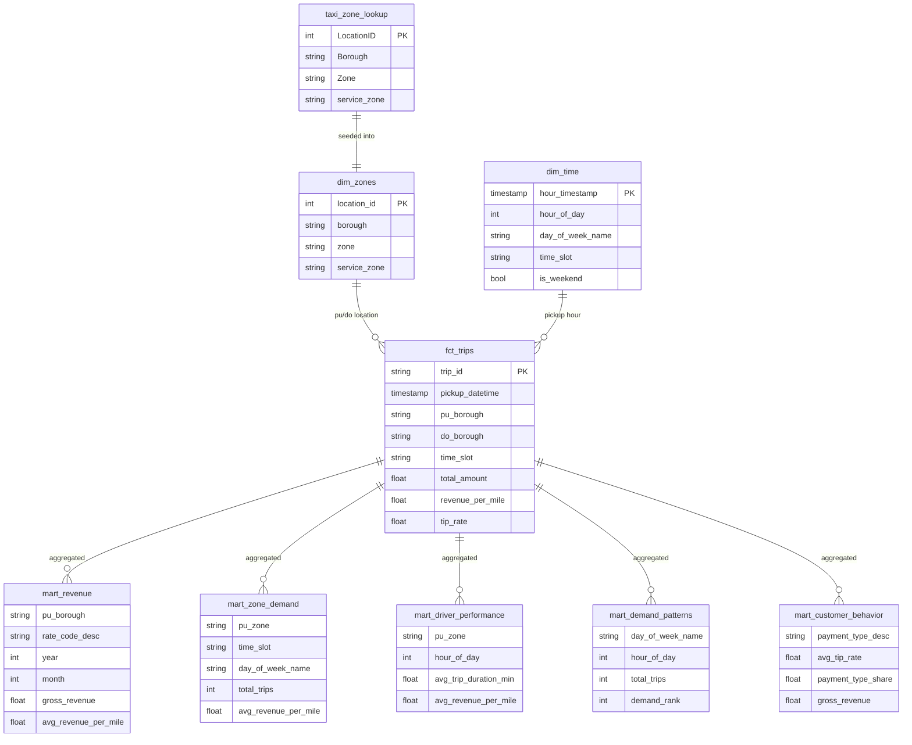
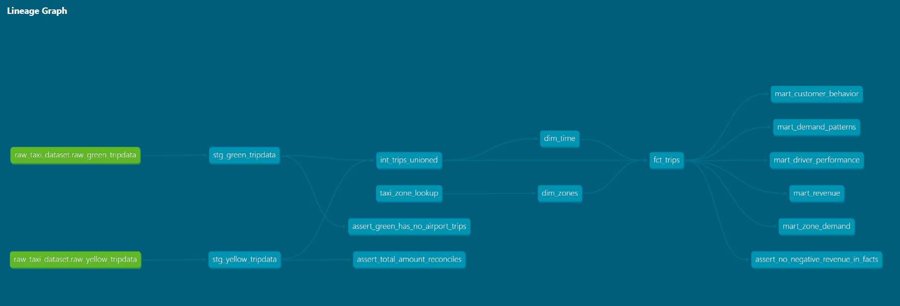
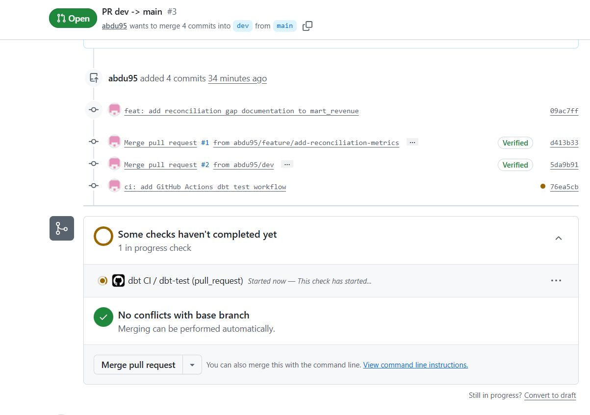

# NYC Taxi Analytics 


## Introduction

This project builds an end-to-end analytics pipeline on the NYC Taxi and Limousine
Commission (TLC) trip dataset — one of the largest and most detailed public
transportation datasets in the world, covering millions of yellow and green taxi
trips across New York City from 2024 onwards.


The dataset was chosen for three reasons. 

1. It is rich enough to support meaningful business analytics — every trip record contains fare components,
timestamps, pickup and dropoff locations, payment behavior, and distance, which
together enable a complete revenue and operational intelligence story. 
2. It has real-world data quality challenges — schema evolution across years,
vendor-specific reporting inconsistencies, duplicate records, and fare
reconciliation gaps — which make it an honest test of engineering decisions rather
than a clean textbook exercise. 
3. It is publicly available, meaning the
pipeline can be fully demonstrated without confidentiality concerns.
The business question driving the project is straightforward:
where and when should a driver operate to maximize revenue?
This is answered through a single North Star metric — Revenue per Mile by Zone
and Time of Day — supported by a full suite of revenue, operational, demand, and
customer metrics delivered through a live Looker Studio dashboard.

The sections below document the architecture, modeling decisions, data quality
findings, and operational practices that make up the complete solution.


## Table of Contents

- [Dashboard](#dashboard)
- [Architecture](#architecture)
- [Documentation](#documentation)
- [Git Branching Strategy](#git-branching-strategy)
- [CI/CD Pipeline](#cicd-pipeline)
- [Metrics](#metrics)


# Dashboard

Live dashboard built in Looker Studio, connected directly to BigQuery mart models.

🔗 [NYC Taxi Analytics Dashboard](https://datastudio.google.com/reporting/6ba53078-fcd9-43b5-b372-e1bf616a2ab4)

### Pages

| Page | Source Model | Key Metrics |
|---|---|---|
| North Star | mart_zone_demand | Revenue per mile by borough and time slot |
| Revenue | mart_revenue | Gross revenue, airport premium, revenue by rate type |
| Demand Patterns | mart_demand_patterns | Busiest days, trips by hour, demand rank |
| Operational | mart_driver_performance | Avg trip duration, utilization by zone and hour |
| Customer | mart_customer_behavior | Tip rate, cash vs card split, revenue per passenger |

### Key Insight

Evening rush hour in Manhattan generates the highest revenue per mile across
all boroughs and time slots — meaning drivers maximize earnings by staying
in Manhattan between 5-7pm rather than taking long Newark or JFK trips
during off-peak hours.


# Architecture


## Stack
- **Ingestion**: Airflow + Python → GCS → BigQuery
- **Transformation**: dbt Core + BigQuery
- **BI**: Looker Studio

---

## Modeling Approach
Dimensional modeling with Medallion Architecture (Bronze → Silver → Gold).

---

## Layer Structure

```
Raw Layer (BigQuery) — Bronze
    Airflow ingests monthly parquet files from TLC → GCS → BigQuery
    raw_yellow_tripdata
    raw_green_tripdata

        ↓ dbt staging

Staging Layer (dbt views) — Silver
    stg_yellow_tripdata — cleaned, typed, flagged, fare reconciliation metrics
    stg_green_tripdata  — same + green-specific trip_type, NULL airport columns

        ↓ dbt intermediate

Intermediate Layer (dbt view) — Silver
    int_trips_unioned   — yellow + green unioned into identical schema

        ↓ dbt dimensions + facts

Dimensions (dbt tables) — Gold
    dim_zones           — LocationID → Borough → Zone mapping (from seed)
    dim_time            — hour, day_of_week, time_slot, is_weekend

Facts (dbt incremental table) — Gold
    fct_trips           — one row per valid deduplicated trip, fully enriched

        ↓ dbt marts

Marts (dbt tables) — Gold
    mart_revenue            — gross revenue by borough, rate type, month
    mart_zone_demand        — trips and revenue per mile by zone and time slot
    mart_driver_performance — utilization and duration by zone and hour
    mart_demand_patterns    — busiest days and hours
    mart_customer_behavior  — tip rate, payment split, revenue per passenger
```


## Documentation

Full column-level documentation, model descriptions, and lineage graph
are available via dbt docs:

```bash
dbt docs generate
dbt docs serve
```


---

## ERD




## Lineage




# Git Branching Strategy

Three-branch workflow:

```
main          ← production, always stable and deployable
dev           ← integration branch, tested code merged here first
feature/xxx   ← one branch per feature, model, or fix
```

## Workflow

```
feature/add-reconciliation-metrics
        ↓ Pull Request → code review
       dev
        ↓ Pull Request → stable release
      main
```

## Rules

- Never commit directly to `main`
- Every change starts as a `feature/` branch cut from `dev`
- Feature branch → PR to `dev` → review → merge
- `dev` → PR to `main` → only when stable and tested
- dbt tests must pass before any PR is merged


# CI/CD Pipeline

Automated testing via GitHub Actions on every Pull Request to `dev` and `main`.

## Workflow

```
feature branch → PR to dev → GitHub Actions runs dbt test → merge if green
dev            → PR to main → GitHub Actions runs dbt test → merge if green
```

## What the pipeline does

1. Checks out the code
2. Installs Python and dbt-bigquery
3. Authenticates to GCP using a service account key stored as a GitHub Secret
4. Runs `dbt deps` to install packages
5. Runs `dbt compile` to catch syntax errors
6. Runs `dbt test --select staging` to validate data quality





## Why staging only in CI?

- Fast — completes in under 30 seconds
- Catches the most common breakage — column renames, source changes, type mismatches
- Fact and mart tests depend on large tables — too slow and expensive for every PR

## Secrets management

- GCP service account key stored as `GCP_SERVICE_ACCOUNT_KEY` GitHub Secret
- Never committed to the repository
- `.gitignore` excludes the `gcp/` folder containing credentials

---
# Metrics 

## North Star Metric

**Revenue per Mile by Zone and Time of Day**

```sql
SAFE_DIVIDE(total_amount, trip_distance) AS revenue_per_mile
```

Answers the core business question: **where and when should drivers
operate to maximize earnings?**

Combines:
- A single quantifiable number
- Geographic dimension (zone → borough)
- Temporal dimension (rush hour vs off-peak)

Example insight: *"Thursday evening rush, Midtown → JFK = highest revenue
per mile + longest duration = the single best shift for a driver"*

---

## Business Metric Definition

**Primary metric: Gross Trip Revenue**

> "Gross Trip Revenue is defined as the sum of total_amount for completed
> trips paid by credit card or cash (payment types 1 and 2), excluding
> disputed, voided, and zero-fare trips. Adjustments and disputes are
> tracked separately for operational monitoring."

### Payment Type Strategy

| Payment Type | Include in Revenue? | Reason |
|---|---|---|
| 0 — Flex Fare | ✅ Yes | Real completed trip |
| 1 — Credit Card | ✅ Yes | Real completed trip |
| 2 — Cash | ✅ Yes | Real completed trip |
| 3 — No Charge | ❌ No | No money exchanged |
| 4 — Dispute | ❌ No | Contested, unresolved |
| 5 — Unknown | ⚠️ Flagged | Cannot confirm |
| 6 — Voided | ❌ No | Trip never happened |

### Why handle in dbt, not ingestion?

```
raw layer    → preserve everything including negatives and disputes
staging      → flag invalid trips, no filtering yet
fct_trips    → filter is_invalid_trip=FALSE, payment_type IN (1,2)
marts        → clean revenue numbers for business metrics
```

Raw data is never modified — full auditability is preserved. If someone
later wants to analyze disputes or voids, the data is always there in raw.

---

## Key Design Decisions

### Why incremental fct_trips?
New parquet files arrive monthly from TLC. Incremental model merges only
new data rather than rebuilding the entire fact table on every run.
On first run it builds the full table. On subsequent runs it processes
only trips after MAX(pickup_datetime).

### Why deduplicate in fct_trips?
VendorID=2 (VeriFone) submits duplicate records — same trip recorded twice.
ROW_NUMBER() partitioned by pickup_datetime, dropoff_datetime, location IDs,
vendor, fare_amount, and total_amount keeps exactly one record per unique trip.

### Why separate yellow and green staging?
Green has different timestamp column names (lpep vs tpep), an extra
trip_type column (street-hail vs dispatch), and no airport_fee column.
Separate staging models handle these differences cleanly before unioning
in the intermediate layer. Both models produce identical output schemas.

### Why ALLOW_FIELD_ADDITION in Airflow?
TLC added cbd_congestion_fee column in 2025. Airflow DAG uses schema
autodetect + _sync_schema helper to automatically add new columns when
they appear in incoming parquet files — no hardcoded schema required.

---

## Sensitive Data Handling

### The Risk
PULocationID + pickup_datetime combination creates **passenger
re-identification risk**. If someone consistently picks up from zone 161
(Upper East Side) at 8:47am every Monday going to JFK — that pattern
identifies a real individual even in "anonymous" public data.
This is called the **mosaic effect** — no single field is sensitive,
but combined they form an identifying picture.

### The Approach — Architectural Masking
We deliberately reduce location precision across layers:

```
staging/facts  → exact zone IDs (pu_location_id, do_location_id)
                 available to engineers only
      ↓
marts          → borough level only (pu_borough, do_borough)
                 exposed to analysts
```

Analysts get what they need for business analysis (borough-level patterns)
without the re-identification risk of exact zone + timestamp combinations.
This is enforced architecturally — mart models never expose raw zone IDs.

### Column Descriptions (in YAML)

```yaml
# staging — document the sensitivity
- name: pu_location_id
  description: >
    Raw pickup zone ID. Masked to borough level in mart layer
    to prevent re-identification of individual passenger journeys
    via location + timestamp combination.

# marts — document the intent
- name: pu_borough
  description: >
    Pickup borough — masked aggregation of pu_location_id.
    Deliberately exposed at borough level only to protect passenger privacy.
```

---

## Fare Reconciliation

`total_amount` is documented as the sum of all itemized components:

| Component | Description |
|---|---|
| fare_amount | Time-and-distance fare from the meter |
| extra | Miscellaneous extras and surcharges |
| mta_tax | Tax triggered by the metered rate |
| tip_amount | Credit card tips only — cash tips excluded |
| tolls_amount | All tolls paid during the trip |
| improvement_surcharge | Surcharge assessed at flag drop (since 2015) |
| congestion_surcharge | NYS congestion surcharge |
| airport_fee | Fee for pickups at LGA or JFK |
| cbd_congestion_fee | MTA Congestion Relief Zone charge (since Jan 5, 2025) |

### Known Vendor Reconciliation Issues

| VendorID | Vendor | Issue |
|---|---|---|
| 1 | Creative Mobile | Excludes congestion_surcharge from total_amount |
| 2 | VeriFone | Submits duplicate records |
| 6 | Myle Technologies | Null RatecodeID, malformed records |
| 7 | Helix | Unitemized Newark surcharge included in total_amount |

Rather than fixing total_amount, we expose the gap as a queryable metric:

```sql
{{ calculate_fare_components() }}          AS calculated_total,
total_amount - calculated_total            AS reporting_gap,
CASE
    WHEN ABS(reporting_gap) <= 0.01 THEN 'reconciled'
    WHEN total_amount > calculated_total  THEN 'underreported_components'
    ELSE                                       'overcounted_components'
END                                        AS reconciliation_status
```

---

## Data Quality

### dbt Tests
- 35 tests across staging and fact layers
- Built-in tests: not_null, unique, accepted_values, relationships
- 3 singular tests for business-specific rules:

| Test | Purpose |
|---|---|
| assert_total_amount_reconciles | Catches vendors with unexplained fare gaps |
| assert_no_negative_revenue_in_facts | Confirms invalid trip filter works |
| assert_green_has_no_airport_trips | Enforces green taxi business rule |

### Known Data Quality Issues

| Issue | Detail |
|---|---|
| Fare reconciliation gaps | VendorID 1, 2, 6, 7 include unitemized charges in total_amount |
| Duplicate records | VendorID=2 (VeriFone) submits identical trip records |
| Schema evolution | cbd_congestion_fee added in 2025 — NULL for all 2024 records |
| Negative amounts | Disputed/voided trips (payment_type 4, 6) produce negative fares |

---

## Macros

| Macro | Purpose | Used In |
|---|---|---|
| calculate_fare_components(airport_fee) | Sums all fare components, optional airport_fee param | stg_yellow, stg_green |
| classify_time_of_day(column) | Returns morning_rush, evening_rush, overnight, off_peak | dim_time |
| revenue_per(numerator, denominator) | SAFE_DIVIDE wrapper for revenue metrics | fct_trips |
| hash_sensitive_field(column) | SHA256 hashing for sensitive fields | staging |